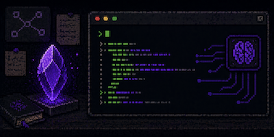

# Obsidian Any AI Code



Obsidian desktop plugin that opens your **local Claude Code CLI** in a right sidebar panel.

## Goal

Use Claude Code directly inside your active Obsidian vault without leaving Obsidian.

## Features

- Dedicated `Claude Code` view in the right sidebar
- Embedded terminal (xterm)
- Quick actions: `Start`, `Stop`, `Restart`, `Clear`
- Launches Claude in the **current active vault folder**
- Visible UI status (`Status: ...`)
- Explicit runtime error messages in the panel
- Runtime fallbacks for macOS / Linux / Windows

## Requirements

- Obsidian Desktop (`isDesktopOnly` plugin)
- Node.js installed on the machine
- Claude Code CLI installed (`claude` available)
- For advanced macOS/Linux fallback: `python3` recommended

## Install in a Vault

### Recommended — from a GitHub release

1. Open the [latest release](https://github.com/blamouche/obsidian-any-ai-code/releases/latest).
2. Download `obsidian-any-ai-code-<version>.zip`.
3. Unzip it directly inside your vault's plugin folder so the resulting path is:

   ```
   /PATH/TO/VAULT/.obsidian/plugins/obsidian-any-ai-code/
   ```

4. In Obsidian, enable the plugin: `Settings → Community plugins → Installed plugins → Any AI Code`.

That's it. No commands required — the plugin uses an embedded Python PTY bridge fallback so it works out of the box on macOS / Linux (and falls back to direct pipe mode on Windows).

### Optional — install the native PTY backend for best terminal fidelity

The bundle ships without `node-pty` (a native module that has to be compiled for your specific Node ABI). The plugin works without it, but installing it gives you a fully native PTY (better full-screen TUI rendering and resize behavior). To enable it:

```bash
cd "/PATH/TO/VAULT/.obsidian/plugins/obsidian-any-ai-code"
npm install --omit=dev
```

Reload the plugin afterwards.

### Manual install / dev clone

1. Clone or copy the repository into `/PATH/TO/VAULT/.obsidian/plugins/obsidian-any-ai-code/`.
2. Run `npm install` and `npm run build` inside the folder to produce `main.js`.
3. Enable the plugin in `Settings → Community plugins`.

### Required files

If you assemble the plugin folder by hand, make sure these are present:

- `manifest.json`
- `main.js`
- `styles.css`
- `versions.json`
- `pty-proxy.js`
- `pty-bridge.py`
- `package.json` and `package-lock.json` (only needed if you plan to install `node-pty`)

## Usage

- Click the terminal ribbon icon, or run command:
  - `Open Claude Code panel`
- The panel opens on the right.
- Click `Start` to launch Claude.

## Plugin Settings

- `Command`: command to run (default: `claude`)
- `Auto-start`: starts automatically when panel opens
- `Node executable`:
  - `auto` (recommended): automatic detection
  - or explicit path (`/opt/homebrew/bin/node`, `C:\Program Files\nodejs\node.exe`, etc.)

## Runtime Architecture (Fallback Chain)

The plugin tries multiple strategies to maximize startup success:

1. PTY via `node-pty`
2. Python PTY bridge fallback (`pty-bridge.py`) on macOS/Linux
3. Direct pipe fallback (`child_process`)
4. `script` fallback (last resort on Unix)

Status and logs clearly show the active strategy (`proxy-warn`, `proxy-info`, etc.).

## Troubleshooting

### `command not found: claude`

Claude binary is not in Obsidian process `PATH`.

- Set `Command` to an absolute path, for example:
  - `/Users/<you>/.local/bin/claude`
- Or adjust your shell/Obsidian environment.

### `Cannot find module 'node-pty'`

Since 0.1.25, this no longer crashes the plugin — `node-pty` is optional and the proxy automatically falls back to the Python bridge (or direct pipe). If you want the native PTY backend anyway:

```bash
cd "/PATH/TO/VAULT/.obsidian/plugins/obsidian-any-ai-code"
npm install --omit=dev
```

### `posix_spawnp failed`

Native PTY failed in the current runtime environment.

- Plugin should automatically fallback to Python/pipe mode.
- Ensure `python3` is installed for Python PTY fallback.

### Empty panel

- Ensure `main.js` **and** `styles.css` are up to date
- Reload plugin (disable/enable)
- Open Obsidian developer console if needed

## Local Development

```bash
npm install
npm run test
npm run build
```

- `npm run dev`: esbuild watch mode
- `npm run build`: compile `main.ts` -> `main.js`

## Test Stack

- Framework: Vitest
- Tests: `tests/**/*.test.ts`
- Commands:
  - `npm run test`
  - `npm run test:watch`

## CI

GitHub Actions workflow: `.github/workflows/ci.yml`

Triggers:

- `push`
- `pull_request`

Steps:

1. `npm ci`
2. `npm run test`
3. `npm run build`

## Release

GitHub Actions workflow: `.github/workflows/release.yml`

Triggered by pushing a git tag (e.g. `0.1.25`):

```bash
git tag 0.1.25
git push origin 0.1.25
```

The workflow:

1. Checks out the repo and runs `npm ci` + `npm run build`.
2. Stages every runtime-required file (`manifest.json`, `main.js`, `styles.css`, `versions.json`, `pty-proxy.js`, `pty-bridge.py`, `package.json`, `package-lock.json`) into an `obsidian-any-ai-code/` folder.
3. Zips it as `obsidian-any-ai-code-<tag>.zip` for one-click install.
4. Publishes a GitHub Release attaching the zip plus standalone `main.js` / `manifest.json` / `styles.css` (for Obsidian's plugin update protocol and BRAT).
5. Auto-generates release notes from the commit history.

Before tagging, keep these versions in sync: `manifest.json`, `versions.json`, `package.json`.

## Main Files

- `main.ts`: Obsidian plugin logic
- `main.js`: built distribution file
- `styles.css`: terminal panel styling
- `manifest.json`: Obsidian plugin metadata
- `pty-proxy.js`: runtime proxy (Node)
- `pty-bridge.py`: Python PTY fallback
- `runtime-utils.ts`: testable shared utilities
- `tests/runtime-utils.test.ts`: unit tests

## Platform Notes

- macOS/Linux: full support with Python PTY fallback
- Windows: support via `node-pty` or pipe fallback
- Obsidian Mobile: not supported (`isDesktopOnly`)

## License

MIT
